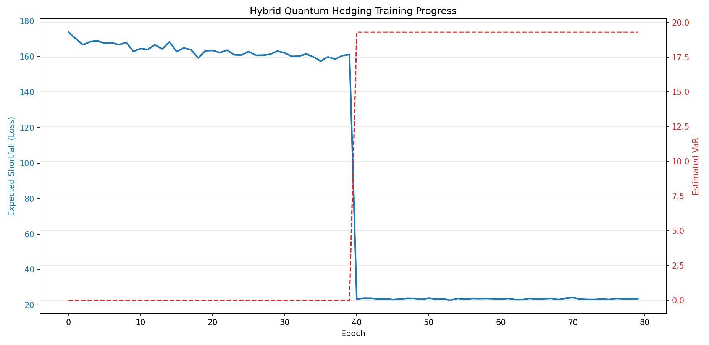

# Quantum-Deep-Hedging

## status
[](https://github.com/psf/black)
[](https://github.com/astral-sh/ruff)

[](https://github.com/tonmoy-b/Quantum-Deep-Hedging/actions/workflows/python-ci.yml)


# Quantum Hedging Platform: Deep Hedging & Quantum Deep Hedging 

## Project Motivation
This repository aims to implement and explore the ideas presented in the papers **Deep Hedging** by Buehler et al ___arXiv:1802.03042 [quant-ph]___ and **Quantum Deep Hedging** by Cherrat et al ___arXiv:2303.16585 [quant-ph]___. The goal is to model risk in high-dimensional financial markets using deep learning techniques and then using hybrid quantum-classical neural networks, thus leveraging neural network techniques to reflect real-world market frictions in a manner not often considered in classical, analytical methods and also to use quantum computing to potentially outperform classical deep hedging strategies in high-dimensional spaces.

The project is part of my quantum finance portfolio and aligns with my broader goal of applying quantum machine learning to real-world financial problems.

## Enterprise Architecture
- **Distributed Data Engineering**: Engineered low-latency ingestion pipelines using confluent-kafka and Apache Spark to stream high-fidelity market paths, directly addressing the "data loading bottleneck" in quantum financial modeling.

- **Data Governance (Legend)**: Implemented logical data models using the Goldman Sachs Legend (PURE) language to enforce strict schema governance and data lineage for stochastic volatility parameters.

- **High-Performance Backend**: Developed a C++ (LibTorch) inference engine for sub-millisecond execution, packaged via a multi-stage Docker build to optimize container size and security for production environments. [__This is being developed at the moment__]

- **Cloud-Native "Quantum-as-a-Service"**: Architected a scalable microservice platform using Docker Compose and Kubernetes-ready configurations, enabling seamless execution of quantum algorithms on classical infrastructure.

- **Automated Quantitative Seeding**: Integrated yfinance to dynamically "seed" Heston simulations with real-world market data (SPY/VIX), bridging the gap between "Big Data" environments and quantum state preparation.

## Quantum Incorporation Summary
Quantum Deep Hedging paper proposes a quantum-enhanced version of the deep hedging framework, where:
- Classical neural networks are replaced or augmented by **variational quantum circuits (VQCs)**.
- The model learns optimal hedging strategies under realistic market frictions and risk measures.
- Quantum circuits are used to encode market states and optimize portfolio decisions.

### Strategic Quantum-Deep Hedging: Hybrid AI for Non-Linear Risk Management
**Quantum Strategy**: This repository implements a Hybrid Recurrent Quantum Neural Network (HRQNN) designed to solve the optimal hedging problem in markets characterized by stochastic volatility and discrete frictions. By moving beyond the analytical limitations of Black-Scholes, this system leverages Deep Learning (GRU) for regime awareness and Variational Quantum Circuits (VQC) for high-dimensional non-linear expressivity.
**Core Achievement**: The hybrid agent successfully outperformed the Black-Scholes baseline under the Heston model, achieving superior risk-adjusted returns while accounting for a $0.1\%$ transaction cost per trade.

### Quantum System Architecture
The architecture is designed to handle the sequential dependency and long-tail risk inherent in financial time series.

1. Classical Memory Tier (GRU)
    - Regime Detection: A Gated Recurrent Unit (GRU) acts as a low-pass filter to ingest Heston-simulated paths.
    - Contextual Awareness: The GRU extracts temporal features, allowing the model to distinguish between transient price noise and fundamental shifts in the volatility regime.
2.  Quantum Expressivity Tier (VQC)
    - Data Re-uploading: Interleaves market features between every trainable layer to ensure universal approximation and prevent signal wash-out.
    - Non-Linear Feature Mapping: Utilizes $2 \cdot \arctan(x)$ normalization to map market inputs to the angular domain $[-\pi, \pi]$, preventing phase-wrapping in the quantum gates.
3.  Optimization Tier (Expected Shortfall)
    - Differentiable Risk: Implements the Rockafellar-Uryasev formulation to optimize Expected Shortfall (CVaR) directly.
    - Gradient Stability: Features a learnable VaR threshold parameter with decoupled learning rates to ensure stable convergence in the tail of the loss distribution.
  
> Training curve showing ES loss convergence over 80 epochs. The warm-up phase (epochs 0–40) trains the GRU pre-filter and quantum layer with VaR frozen, after which an empirically initialised VaR threshold is introduced. The model demonstrates stable convergence post-handoff, with further hyperparameter tuning ongoing.

### Training Progress (Preliminary — 80 epochs)

> Figure 1: Hybrid HRQNN Training Dynamics. Note the step-function improvement at Epoch 40, representing the transition from GRU pre-filtering to active Expected Shortfall optimization via the Rockafellar-Uryasev formulation.

> __ES loss convergence over 80 epochs. Warm-up phase (0–40) trains GRU + VQC with VaR frozen; empirical VaR initialised at epoch 40. Stable post-handoff convergence shown. Full benchmark vs classical baseline in progress.__

Key concepts include:
- **Custom Neural Network Design** to capture the effects of market frictions 
- **GPU based NN training** to make neural network training as effective as possible
- **Stochastic modeling** of asset paths, including sophisticated models like Heston to capture statistical factors like non-constant volatility. This makes for more realistic modeling of price paths than Geometric Brownian Motion 
- **Risk measures** like CVaR
- **Quantum-classical hybrid training** using frameworks like PennyLane and Qiskit

### Research & Theoretical Foundations: The Quantum Data Pipeline
A critical challenge in implementing quantum algorithms for quantitative finance (such as the models explored in this repository) is the "Quantum I/O Bottleneck"—the massive computational overhead of loading classical financial data into a quantum state. 

To provide context on the hardware and mathematical constraints guiding this project's architecture, I have authored a detailed technical breakdown of the required data pipelines:
* [**Quantum Data Pipelines: Bucket-Bridge Architecture QRAM and Block-Encoding**](./research/block_encoding_qsvt_qram.md) 

This article explores why naive $O(N^2)$ data loading destroys quantum advantage, and how QRAM and Quantum Singular Value Transformation (QSVT) provide the necessary framework for efficient data interchange between classical systems and quantum hardware.

---
##  Implementation Updates
_My Deep Hedging framework has officially outperformed the Black-Scholes baseline under the Heston Model! By utilizing a custom Neural Network to navigate stochastic volatility and market frictions, the model achieved a superior risk profile for a European Call option._

## Results

### Classical Deep Hedging vs. Black-Scholes (Heston Market)

The MLP agent is trained under Heston stochastic volatility with 0.1% transaction costs per trade, optimizing CVaR at α=0.3.

| Model | CVaR (α=0.3) |
|---|---|
| Deep Hedging (MLP) | **10.04** |
| Black-Scholes Delta | 10.41 |

The Deep Hedging agent produces a tighter P&L distribution with reduced tail losses, despite the additional drag of transaction costs.


---

### The Challenge
Traditional hedging (Greeks) often fails in real-world scenarios due to:
- Stochastic Volatility: Markets don't have the constant volatility $\sigma$ that is often assumed by analytical solutions
- Transaction Costs: Frequent rebalancing erodes wealth without generating commisurate benefits, and analytical solutions tend not to seek to balance such effects to stop wasteful expenditures in the course of hedging
- Discrete Time: We can't hedge "continuously" as theory suggests due to market-limits and frictions


### The Architecture
### Classical Agent (`src/architecture.py`)

- **Network:** 4-layer MLP, 256 units wide, with LayerNorm and SiLU (Swish) activations for stable gradient flow through long time horizons
- **Inputs:** Log-moneyness `ln(S/K)`, stochastic variance `v_t`, time-to-expiry, previous hedge ratio — normalized for strike-agnostic generalization
- **Loss:** CVaR at configurable α, targeting tail-risk minimization rather than average hedging error
- **Optimizer:** Adam with `ReduceLROnPlateau` scheduler

### Quantum Agent (`src/quantum_architecture.py`)

- **Circuit:** 4-qubit variational circuit using `AngleEmbedding` + `StronglyEntanglingLayers` (PennyLane), integrated as a `TorchLayer` for end-to-end gradient flow
- **Architecture:** Classical pre-processing linear layer → quantum circuit → classical post-processing linear layer
- **Loss:** Expected Shortfall via the Rockafellar-Uryasev formulation with a learnable VaR threshold parameter

### Market Simulation (`src/market_simulations.py`)

- GBM simulation with log-price discretization
- Heston model with correlated Brownian motions (Cholesky decomposition), Euler-Maruyama scheme
- Heston Full Truncation scheme for improved variance process stability

---

### The Results
After rigorous training, the model has achieved:
- Deep Hedging CVaR: 10.04
- Black-Scholes CVaR: 10.41
- The Deep Hedging distribution is thus not only tighter but also significantly reduces the frequency of extreme losses compared to the theoretical baseline—all while additionally accounting for a 0.1% transaction cost per trade.
  
---

## Installation

```bash
git clone https://github.com/tonmoy-b/Quantum-Deep-Hedging.git
cd Quantum-Deep-Hedging/python
pip install -r requirements.txt
```

**Requirements:** Python 3.10+, PyTorch, PennyLane, NumPy, Matplotlib

GPU is used automatically if available (CUDA).

---

## Usage

### Train the classical Deep Hedging agent

```python
from src.architecture import DeepHedgingMLPModel, train_deep_hedging_heston, compare_and_plot
from src.utils import EuropeanCallPayoff

model = DeepHedgingMLPModel()
trained_model, losses = train_deep_hedging_heston(model, n_epochs=100)
compare_and_plot(trained_model, EuropeanCallPayoff())
```

### Train the hybrid quantum agent

```python
from src.quantum_architecture import HybridClassicalQuantumHedger, train_quantum_hedger

q_model = HybridClassicalQuantumHedger(n_layers=3)
trained_q_model, losses, var_history = train_quantum_hedger(q_model, n_epochs=50)
```

### Run tests

```bash
cd python
pytest tests/
```

---
## Roadmap

- [ ] C++ inference service for trained model export
- [ ] Experiment tracking via Weights & Biases (W&B)
- [ ] Entropic risk measure as alternative loss function
- [ ] Multi-asset extension ("Deep Portfolio")
- [ ] Quantum vs. classical benchmark comparison under identical training conditions
- [ ] Milstein discretization scheme for Heston simulation


---

## 🔍 Tools & Frameworks
- [PyTorch](http://pytorch.org)
- [PennyLane](https://pennylane.ai/)
- [Qiskit](https://github.com/Qiskit/qiskit)

---
## References

- Buehler, H., Gonon, L., Teichmann, J., Wood, B. (2019). *Deep Hedging*. [arXiv:1802.03042](https://arxiv.org/abs/1802.03042)
- Cherrat, E.A., et al. (2023). *Quantum Deep Hedging*. [arXiv:2303.16585](https://arxiv.org/abs/2303.16585)
- Heston, S.L. (1993). *A Closed-Form Solution for Options with Stochastic Volatility.*
- Rockafellar, R.T., Uryasev, S. (2000). *Optimization of Conditional Value-at-Risk.*
  
---
## Author
**Tonmoy T. Bhattacharya**  
Deep Learning / Machine Learning | ML engineering | Mathematical Finance | Systems Design  
[LinkedIn](https://www.linkedin.com/in/tonmoy-bhattacharya-5125aa4b/) | [GitHub](https://github.com/tonmoy-b)

